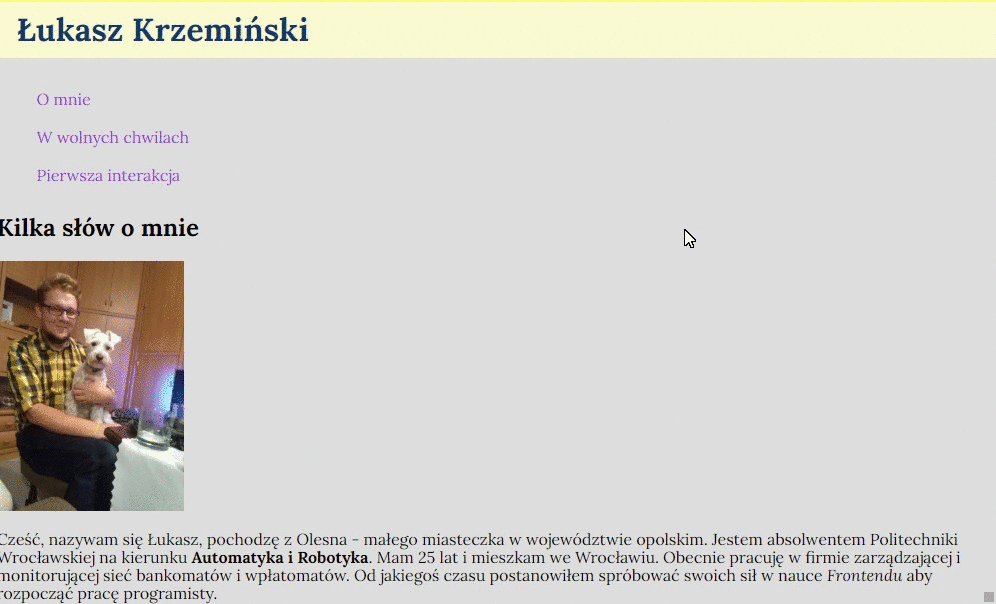

# My First Homepage

## It's the first website i've made. Serves me as a place to practice newly aquired programming skills.

### Description
On this page I practiced basic html tags, basic CSS styling  and first js interaction. I also added a basic table and styled it. I will update this project as soon as i learn new stuff.

### What You can do

- Navigation links will lead you to certain sections of the page
- The table responds to hovering the rows by highliting chosen row
- The button will change the background on click as well as the description in the button

### Preview

### Technologies Used

- HTML
- CSS
- JS

### Author
Łukasz Krzemiński

### Contact
contact me at: [krzeminski.lukasz@interia.pl](krzeminski.lukasz@interia.pl)